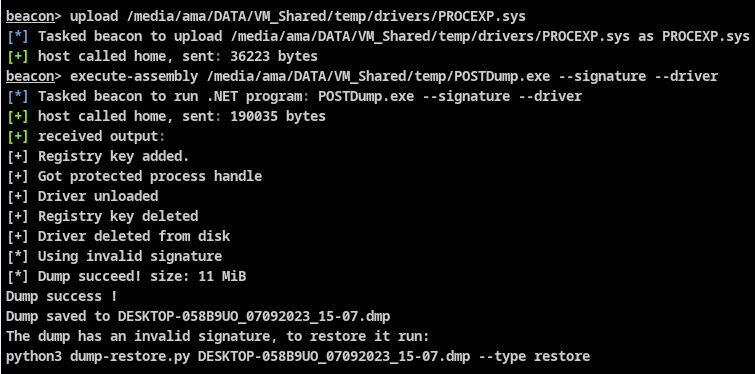

# POSTDump

----

Another tool to perform minidump of LSASS process using few technics to avoid detection.

POSTDump is the C# / .NET implementation of the ReactOS minidump function (like nanodump), thus avoiding call to the Windows API MiniDumpWriteDump function.
The dump logic code is saved under the `POSTMinidump` project, feel free to use it for your own projects.

Such as NanoDump, you can encrypt or use an invalid signature for the minidump.

Usage of ProcExp driver is supported to dump/kill protected processes.

## Usage

Dump LSASS:

    c:\Temp>PostDump.exe --help

    -o, --output        Output filename [default: Machine_datetime.dmp] (fullpath handled)

    -e, --encrypt       Encrypt dump in-memory

    -s, --signature     Generate invalid Minidump signature

    --snap              Use snapshot technic

    --fork              Use fork technic [default]

    --elevate-handle    Open a handle to LSASS with low privileges and duplicate it to gain higher privileges
	
    --duplicate-elevate Look for existing lsass handle to duplicate and elevate
	
	--live				Parse creds from memory without writing into file on disk
	
	--fromfile [file]	Parse creds from dump file
	
    --asr               Attempt LSASS dump using ASR bypass (win10/11/2019) (no signature/no encrypt)
	
    --driver            Use Process Explorer driver to open lsass handle (bypass PPL) and dump lsass
	
    --kill [processID]  Use Process Explorer driver to kill process and exit

    --help              Display this help screen.

## Evasion
- Usage of indirect syscall along with halo's gate technic to retrieve syscalls IDs
- No memory Allocation/Protection call is performed for indirect syscall, instead, free RWX codecave found in the current process are used
- ETW patching
- No call to MiniDumpWriteDump
- Live lsass creds parsing (no dump writing)

## Improvements idea
- Implement more dump technics (seclogon, PPLMedic, Shtinkering ..)
- More evasion technics (callstack spoofing)
- Implement [Godfault](https://github.com/gabriellandau/PPLFault) to avoid driver usage

## Compilation
- You can build using .NET Framework 4.5.1 as-is.
- Depending of the CLR version installed on the system where you execute PostDump, you may need to downgrade to .NET 3.5 [more info here](https://learn.microsoft.com/fr-fr/dotnet/framework/migration-guide/versions-and-dependencies)

## Sponsors

  

I work at *POST Luxembourg* and thank them for allocating some time for me to develop and maintain this project! Visit POST website at https://www.post.lu/business/produits-et-services/cyberforce.

## Credits
- [s4ntiago_p](https://twitter.com/s4ntiago_p) for the awesome NanoDump tool
- [Yaxser](https://github.com/Yaxser/Backstab) (procexp driver)
- [SECFORCE] (https://github.com/SECFORCE/SharpWhispers) for finding RWX codecave
- [0xAbdullah](https://github.com/0xAbdullah/) for [ASR](https://github.com/0xAbdullah/Offensive-Snippets/blob/main/C%23/PInvoke/ASR_bypass_to_dump_LSASS.cs) technic 
- [cube0x0] (https://github.com/cube0x0/MiniDump) for Minidump lib to parse lsass

## Disclaimer
This software has been created purely for the purposes of academic research and for the development of effective defensive techniques, and is not intended to be used to attack systems except where explicitly authorized. Project maintainers are not responsible or liable for misuse of the software. Use responsibly.
